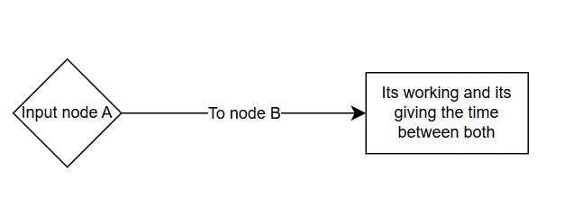
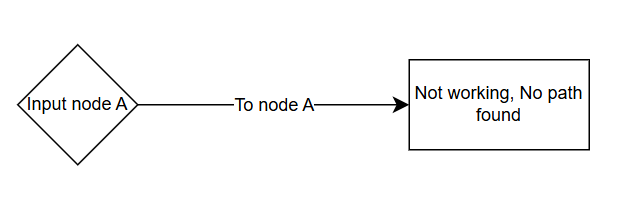

# Functional Specifications

|Author|Loïc NOGUES|
|:-:|:-:|
|**Helper**|**Léna DE GERMAIN**|
|Created|01/06/2024|
|Finished|01/16/2024|

📖 Table of content

  - [I. Overview](#i-overview)
    - [A. Project summary](#a-project-summary)
    - [B. Out of Scope](#b-out-of-scope)
    - [C. Personas](#c-personas)
    - [D. Use case](#d-use-case)
  - [II. Functional requirements](#ii-functional-requirements)
      - [A. Node and Path Management](#a-node-and-path-management)
      - [B. Fastest Path Calculation](#b-fastest-path-calculation)
      - [C. REST API Specification](#c-rest-api-specification)
  - [III. Non-Functional Requirements](#iii-non-functional-requirements)
      - [A. Programming Language](#a-programming-language)
      - [B. Performance](#b-performance)
      - [C. Scalability](#c-scalability)
      - [D. API Accessibility](#d-api-accessibility)
      - [E. Data Format Compatibility](#e-data-format-compatibility)
      - [F. Reliability](#f-reliability)
  - [IV. Feature of the API](#iv-feature-of-the-api)
      - [1. Advanced Pathfinding Features](#1-advanced-pathfinding-features)
      - [2. Scalability and Performance Enhancements](#2-scalability-and-performance-enhancements)
      - [3. Multi-Language Support](#3-multi-language-support)
  - [V. Future improvement](#v-future-improvement)
  - [VI. Glossary](#vi-glossary)

# I. Overview

## A. Project summary

SmashThePath aims to determine the time between two nodes and find the fastest way. Users can use it to save time and travel more effectively across the United States. This project is an opportunity to dive into the renowned C++ language [^3]. Our main goal is to create an easier way to determine the fastest time between two nodes.

## B. Out of scope

|Sellable API|Complex API|
|-|-|
|The project aims to teach us a simple and useful way to manage travel with our API. It is not intended to be very large or commercially viable by the final deadline. |To complete this project, we need to create an API that meets our requirements. An overly complicated interface could be difficult for new users to handle.

## C. Personas
This project will not include personas, for the simple reason that the people who will use it, must understand how it works and be able to code a software to use SmashThePath effectively.

## D. Use case

### 1st use case

### 2nd use case

### 3th use case

# II. Functional requirements
## A. Node and Path Management
The system shall allow defining nodes (landmarks) and their connections with specified travel times.
It shall support reading node and connection data from a file (e.g., USA-roads.csv).

## B. Fastest Path Calculation
The system shall calculate the fastest path and total travel time between two nodes based on the given data.
It shall provide an ordered list of landmarks in the path.

## C. REST API Specification
Expose a GET endpoint that accepts:
Input: Source and destination node IDs.
Output:
Travel time.
Ordered list of landmarks in the path.
Response formats: JSON and XML.

# III. Non-Functional Requirements

## A. Programming Language
The software must be implemented in C++ to ensure optimal performance and efficient memory handling.

## B. Performance
The system should calculate the fastest path for typical queries within 1 second.

## C. Scalability
The software must efficiently handle large datasets (e.g., 24 million nodes in USA-roads.csv).

## D. API Accessibility
The REST API must run on an HTTP server accessible via localhost and support concurrent requests.

## E. Data Format Compatibility
The system shall ensure compatibility with CSV files and handle potential errors like missing or malformed data.

## F. Reliability
The system must ensure accurate results for pathfinding, even under high load or large datasets.

# IV. Feature of the API
The travel time between the node A and the node B.

# V. Future improvement
## 1. Advanced Pathfinding Features
### Dynamic Weights:
Incorporate real-time data such as traffic conditions, weather, or road closures to dynamically adjust travel times.
### Multi-Criteria Optimization:
Allow users to optimize paths based on multiple criteria, such as shortest distance, fastest time, or cost

## 2. Scalability and Performance Enhancements
### Distributed Computation:
Implement distributed graph processing using frameworks like Apache Giraph or GraphX to handle extremely large datasets.
### Pre-computation and Caching:
Pre-compute and cache the shortest paths for commonly requested queries to reduce response times.
## 3. Multi-Language Support
### code languages
Extend the API to support additional programming languages (e.g., Python, Java) via SDKs or client libraries.

### Language support
Add other language for the API like french or many others. 

# VI. Glossary

[^1] : Data 

Facts and statistics collected together for reference or analysis.

Source: Wikipedia

[^2] : RESTAPI

An application programming interface (API) that follows the design principles of the REST architectural style.

Source: Wikipedia 

[^3] : C++

An object-oriented programming (OOP) language that is viewed by many as the best language for creating large-scale applications.

Source: Wikipedia

[^4] : VScode

An integrated development environment developed by Microsoft for Windows, Linux, macOS and web browsers. 

[^5] : JSON/XML

JSON is an open data interchange format that is readable by both people and machines. JSON is independent of any programming language and is a common API output in a wide variety of applications. XML is a markup language that provides rules to define any data.
Source: Wikipedia

[^6] : GET

Is one of the standard HTTP request methods used in web communication. It is typically used to retrieve data from a server without modifying its state. GET requests are widely employed in RESTful APIs, websites, and web applications for fetching resources or information.

Source: Wikipedia
