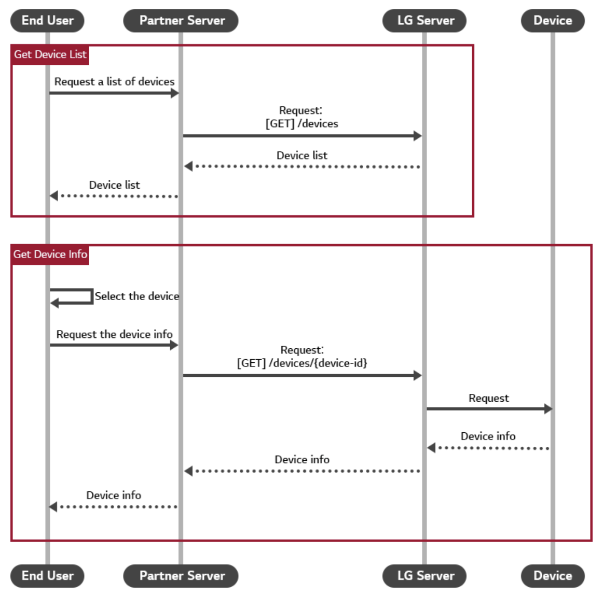
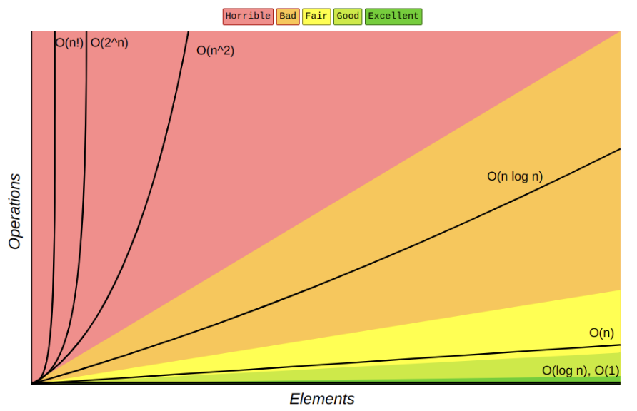
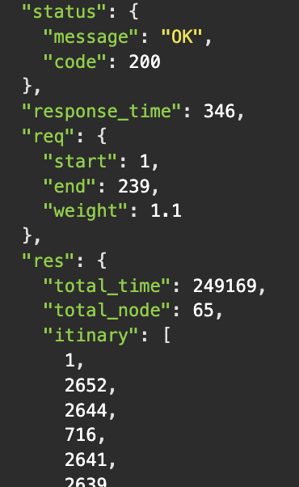
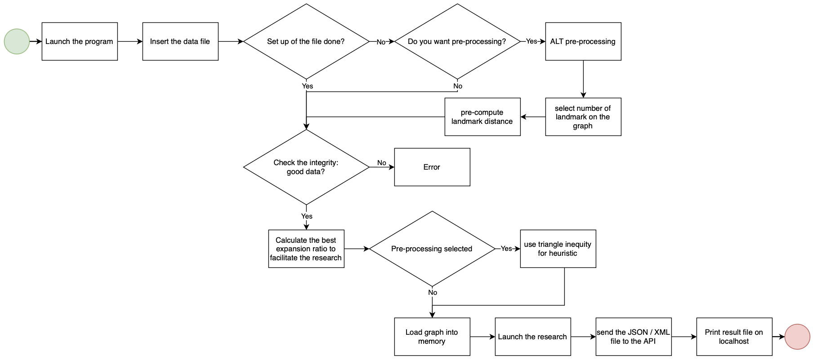

# Technical Specifications


<details>
<summary>📖 Table of content</summary>

- [Technical Specifications](#technical-specifications)
  - [I. Document](#i-document)
    - [A. Information](#a-information)
    - [B. History](#b-history)
    - [C. Overview](#c-overview)
  - [II. Solution](#ii-solution)
    - [A. Requirements](#a-requirements)
    - [B. Description](#b-description)
      - [1. Architectural Components](#1-architectural-components)
        - [a. Documents](#a-documents)
        - [b. API](#b-api)
        - [c. Data Management](#c-data-management)
        - [d. Complexity](#d-complexity)
      - [2. Workflow Example](#2-workflow-example)
      - [3. Technology Stack](#3-technology-stack)
    - [C. How it works ?](#c-how-it-works-)
      - [1. Includes](#1-includes)
      - [2. Integrity checking](#2-integrity-checking)
      - [3. Connectivity checking](#3-connectivity-checking)
      - [4. Graph](#4-graph)
      - [5. Research algorithm](#5-research-algorithm)
      - [6. API](#6-api)
    - [D. Program architecture diagram](#d-program-architecture-diagram)
  - [III. Quality Control](#iii-quality-control)
    - [A. Documentation and Reporting](#a-documentation-and-reporting)
    - [B. Development](#b-development)
  - [IV. Further considerations](#iv-further-considerations)
    - [A. Technical constraints](#a-technical-constraints)
      - [1. Writing convention](#1-writing-convention)
      - [2. C++ coding convention](#2-c-coding-convention)
      - [3. Hardware](#3-hardware)
    - [B. Cost estimation](#b-cost-estimation)
      - [1. Software](#1-software)
      - [2. Time \& Human](#2-time--human)
    - [C. Security](#c-security)
    - [D. Accessibility](#d-accessibility)
  - [V. Success evaluation](#v-success-evaluation)
  - [Glossary](#glossary)

</details>


## I. Document

### A. Information

| Document writer | Grégory PAGNOUX |
|-|-|
| Issue date | 01/27/2025 |
| Reviewer | Lucas MEGNAN |
| review date | 01/21/2025 |

### B. History

| Version | Edits completed by | Date | Description of edit |
|:-:|---|---|---|
| 1.1 | Grégory PAGNOUX | 01/06/2025 | Template, [Writing convention](#1-writing-convention), [Quality Control](#iii-quality-control) part A, [Success evaluation](#v-success-evaluation) |
| 1.2 | Grégory PAGNOUX | 01/08/2025 | [Development](#b-development), [Software](#1-software), [Time & human](#2-time--human), [Overview](#c-overview), [Documents](#a-documents) |
| 1.3 | Grégory PAGNOUX | 01/14/2025 | [Coding convention](#2-c-coding-convention) |
| 1.4 | Grégory PAGNOUX | 01/16/2025 | [Description](#b-description), [Security](#c-security), [Accessibility](#d-accessibility), [Glossary](#glossary) |
| 1.5 | Grégory PAGNOUX | 01/17/2025 | [API](#b-api), [Data Management](#c-data-management), [Workflow example](#2-workflow-example), [Technology stack](#3-technology-stack), [How it works](#c-how-it-works-), [Program architecture diagram](#d-program-architecture-diagram) |
| 1.5 | Grégory PAGNOUX | 01/20/2025 | [How it works](#c-how-it-works-), [Glossary](#glossary) |
| 2.1 | Grégory PAGNOUX | 01/21/2025 | [Requirements](#a-requirements), [Hardware](#3-hardware), [Accessibility](#d-accessibility), [Technology stack](#3-technology-stack), [API](#b-api), [Complexity](#d-complexity), Correction issue #19 |

### C. Overview

SmashThePath aim to make travel easier with faster pathing using an API, developed in the C++[^1] language and the software Visual Studio (VS)[^2]. The users can use this to gain time and travel more effectivilly and easily across the United States (the CSV[^3] file used to develop the product is the USA's map).

This project is an oppurtunity to dive into the very famous laguage C++.
Our main goal is to make a very easy and faster way to travel with an API[^4].

## II. Solution

### A. Requirements

| Functional | Non-functional |
|-|-|
| Node and Path Management | Programming Language |
| Fastest Path Calculation | Performance |
| REST API Specification | Scalability |
|  | REST API Accessibility |
|  | Data Format Compatibility |
|  | Reliability |

### B. Description

To complete this project, we need to create an API that manage Nodes and Paths between them, calculate the quickest path from a point A to B, a compatibility with multiple data file type in input of the algorithm and send a response in JSON[^5] or XML[^6] format in 1 second maximum.
The algorithm need to propose one of the 10% best path and the REST API[^7] must run on an HTTP server[^8] accessible via localhost and support concurrent requests.

#### 1. Architectural Components

##### a. Documents

```txt
📦 2024-2025-project-3-quickest-path-team-1
└── 📁 smashthepath
|    └── 📝 Api.cpp
|    └── 📝 Bu_pre.cpp
|    └── 📝 Conf.cpp
|    └── 📝 Connectivity.cpp
|    └── 📝 Decl.h
|    └── 📝 Helper.cpp
|    └── 📝 Incl.h
|    └── 📝 Integrity.cpp
|    └── 📝 Json.hpp
|    └── 📝 Loader.cpp
|    └── 📝 Log.cpp
|    └── 📝 Main.cpp
|    └── 📝 Opti.cpp
|    └── 📝 Perf.cpp
|    └── 📝 Search.cpp
└── 📁 documents
|    └── 📁 images
|    └── 📁 management
|    |   └── 📁 weeklyreport
|    |   |   └── 📝 SummaryTeamAnswers.md
|    |   |   └── 📝 WeeklyReport1.md
|    |   |   └── 📝 WeeklyReport2.md
|    |   |   └── 📝 WeeklyReport3.md
|    |   |   └── 📝 WeeklyReport4.md
|    |   |   └── 📝 WeeklyReport5.md
|    |   |   └── 📝 WeeklyReport6.md
|    |   |   └── 📝 WeeklyReportTemplate.md
|    |   └── 📝 DocumentManagement.md
|    |   └── 📝 PostMortem.md
|    |   └── 📝 ProjectCharter.md
|    |   └── 📝 Settlement.md
|    └── 📝 FunctionalSpecifications.md
|    └── 📝 TechnicalSpecifications.md
|    └── 📝 TestCase.md
|    └── 📝 TestPlan.md
└── 📝 README.MD 
```

##### b. API

The API will expose endpoints for interacting with the system's core functionalities.



It will include:

**Pathfinding Endpoint**:

- **Method**: `GET`
- **Input**: Source node ID, destination node ID
- **Output**:
  - Total travel time (in ms)
  - Point requseted (A, B)
  - Total time (in ms)
  - Total node
  - Itinirary [node]
- **Response Formats**: JSON, XML

To communicate with the API, we use Insomnia[^9]

**Error Handling**:

- Return structured error responses (e.g., `400 Bad Request` for invalid input, `404 Not Found` for non-existent nodes)

*When the algorithm find a path, it return a code message: `200 Path Found`*

**Performance Goals**:

- Response times under 1 second for typical queries
- The path must be within the heuristic[^10] range of 10% of the best paths

##### c. Data Management

This layer focuses on efficient data handling, ensuring scalability[^11] and compliance with privacy standards.

**Local Data Storage**:

- **Node and Path Data**: Stored locally in CSV format, such as `USA-roads.csv`
- **Temporary Cache**: Keeps heuristics data when you launch the program, i.e. give the answer directly if you search the same point to gain time

**Data Import**:

- Supports importing nodes and paths data directly from local CSV files

**Security and Privacy Management**:

- **Error Detection**: Handles malformed or missing data gracefully, logging issues for debugging
- **Data Validation**: Ensures imported data conforms to expected formats (integrity[^12], connectivity, etc)

##### d. Complexity

The goals to reach is a complexity[^13] of log(n) at least.



#### 2. Workflow Example

**Data Linking**:

- When a user uploads a data file, the system processes the data to construct the node network by making a UGC[^14]

**Algorithm Execution**:

- You need to pre-processing[^15] the algorithm to get more fast response time
- Upon initiating the algorithm, the system calculates the quickest path between the specified nodes

**Result Display**:



#### 3. Technology Stack

**Frontend (UI)**:

- Not required for this project. Data are displayed in a text-based format listing all waypoints and distances

**Backend (Logic & Processing)**:

- **Programming Language**: C++ for performance and memory efficiency
- **Libraries**: Utilize C++ standard libraries for file I/O, graph algorithms A*, and JSON serialization (unordered_set, unordered_map, imaip, limits, winsock2.h, ws2tcpip.h)
- **API Framework**: Use an HTTP server library for REST API implementation

### C. How it works ?

#### 1. Includes

To start, we need to include and implement some basic structure class for the product in the incl.h file.

```cpp
struct union_find {
    std::vector<int> parent;
    std::vector<int> rank;

    void resize(size_t n) {
        parent.resize(n);
        rank.resize(n, 0);
        for (size_t i = 0; i < n; ++i) {
            parent[i] = static_cast<int>(i);
        }
    }

    int find_set(int v) {
        if (parent[v] == v) {
            return v;
        }
        parent[v] = find_set(parent[v]);
        return parent[v];
    }

    bool union_set(int a, int b) {
        int root_a = find_set(a);
        int root_b = find_set(b);
        if (root_a == root_b) {
            return false;
        }
        if (rank[root_a] < rank[root_b]) {
            parent[root_a] = root_b;
        }
        else if (rank[root_a] > rank[root_b]) {
            parent[root_b] = root_a;
        }
        else {
            parent[root_b] = root_a;
            rank[root_a]++;
        }
        return true;
    }
};
```

*In this structure, we generate links between nodes to create the tree.*
*The two first line stocks data. The resize method initialize each elements as its own parent and his depth to 0. The find_set method determine the root of the tree that he has in input. The union_set method merge two different trees using the method find to use their root and assemble the final tree.*


```cpp
struct graph_data {
    std::unordered_map<int, size_t> node_to_index;
    std::vector<std::tuple<int, int, int>> edges;

    size_t line_count = 0;
    size_t index_count = 0;

    union_find uf;

    std::unordered_map<int, std::vector<std::pair<int, int>>> adjacency;
};
```

*This structure manage graph information, including mappings of nodes to indices, edges, adjacency lists, a union-find structure, and counters for lines and indices.*


```cpp
struct path_step {
    int node_a;
    int node_b;
    int time;
};
```

*This structure represents a step in a path, containing two nodes (node_a, node_b) and the time (time) associated with the step.*


```cpp
struct path_result {
    int total_time;
    std::vector<path_step> steps;
};
```

*This structure holds the total travel time (total_time) and a sequence of path steps (steps).*

#### 2. Integrity checking

To check informations integrity of the data file (duplicated edges), we are implemented an integrity_validator function in the integrity.cpp file.

```cpp
uint64_t reversed_code = encode_edge(B, A);
if (edge_hash_set.find(reversed_code) != edge_hash_set.end()) {
    std::cout << "[ERROR] integrity conflict : edge (" + std::to_string(A) + "," + std::to_string(B)
        + ") conflicts with (" + std::to_string(B) + "," + std::to_string(A) + ")." << std::endl;
    _logger("Integrity error: edge (" + std::to_string(A) + "," + std::to_string(B)
        + ") conflicts with (" + std::to_string(B) + "," + std::to_string(A) + ").");
    return false;
}
```

#### 3. Connectivity checking

To check the connectivity between all nodes, we are implemented a connectivity_validator function in the connectivity.cpp file.

```cpp
int first_rep = gdata.uf.find_set(0);

size_t i = 0;
for (; i < gdata.node_to_index.size(); ++i) {
    if (gdata.uf.find_set(static_cast<int>(i)) != first_rep) {
        _logger("Graph is NOT fully connected. Disconnection found at index " 
            + std::to_string(i));
        return false;
    }
    if (i % 1'000'000 == 0 && i > 0) {
        _logger("Checked connectivity for " + std::to_string(i) + " nodes...");
    }
}
```

#### 4. Graph

We are creating the graph in the memory in the loader.cpp file.

```cpp
while (std::getline(file_stream, line_data)) 
{
    gdata.line_count++;
    if (line_data.empty()) {
        continue;
    }

    std::stringstream line_stream(line_data);
    std::string val_a, val_b, val_time;
        
    // reading all value inside .csv file & checking if any value is missing.
    if (!std::getline(line_stream, val_a, ',')) {
        std::cout << "[WARNING] Missing Landmark_A_ID at line " + std::to_string(gdata.line_count) << std::endl;
        _logger("Warning: Missing Landmark_A_ID at line " + std::to_string(gdata.line_count));
        continue;
    }
    if (!std::getline(line_stream, val_b, ',')) {
        std::cout << "[WARNING] Missing Landmark_B_ID at line " + std::to_string(gdata.line_count) << std::endl;
        _logger("Warning: Missing Landmark_B_ID at line " + std::to_string(gdata.line_count));
        continue;
    }

    if (!std::getline(line_stream, val_time, ',')) {
        std::cout << "[WARNING] Missing val_time at line " + std::to_string(gdata.line_count) << std::endl;
        _logger("Warning: Missing val_time at line " + std::to_string(gdata.line_count));
        continue;
    }

    int node_a, node_b, time_cost;

    try {
        node_a = std::stoi(val_a);
        node_b = std::stoi(val_b);
        time_cost = std::stoi(val_time);
    }
    catch (const std::exception& e) { // catch any formatting problem of retreived values.
        _logger("Warning: Invalid node/time ID at line "
            + std::to_string(gdata.line_count) + ": " + e.what());
        continue;
    }

    // assign an index if they never been met.
    if (gdata.node_to_index.find(node_a) == gdata.node_to_index.end()) {
        gdata.node_to_index[node_a] = gdata.index_count++;
    }
    if (gdata.node_to_index.find(node_b) == gdata.node_to_index.end()) {
        gdata.node_to_index[node_b] = gdata.index_count++;
    }

    // stock the decree inside a triplet (A, B, time_cost).
    gdata.edges.emplace_back(node_a, node_b, time_cost);

    // adjacence construction
    gdata.adjacency[node_a].push_back({node_b, time_cost});
    gdata.adjacency[node_b].push_back({node_a, time_cost});
}
```

#### 5. Research algorithm

The research algorithm is done thanks the A* method which is implemented in the a_star.cpp file.

```cpp
std::unordered_map<int, int> dist_from_start, dist_from_end;
std::unordered_map<int, std::pair<int, int>> parent_start, parent_end;

const int INF = std::numeric_limits<int>::max();
```

*Initialize structures for distances and parent nodes for both directions and define infinity as the maximum integer value.*


```cpp
if (gdata.adjacency.find(cur_node) != gdata.adjacency.end()) {
    const auto& edges = gdata.adjacency.at(cur_node);
    for (auto& e : edges) {
        int neigh = e.first;
        int cost = e.second;
        int ndist = cur_dist + cost;

        // If a shorter path to a neighbor is found, update the distance and parent.
        if (!dist_from_start.count(neigh) || ndist < dist_from_start[neigh]) {
            dist_from_start[neigh] = ndist;
            parent_start[neigh] = { cur_node, cost };
            forward_queue.push({ ndist, neigh });
        }

        // Check if the neighbor has already been visited in the backward search.
        if (dist_from_end.count(neigh)) {
            int total_potential = ndist + dist_from_end[neigh];
            if (total_potential < best_distance) {
                best_distance = total_potential;
                best_meet_node = neigh;
            }
        }
    }
}
```

*This loop allows to visit neighboors to the current node, check if their is a path and if it was already check.*


```cpp
path_forward.insert(path_forward.end(), path_backward.begin(), path_backward.end());
```

*This line reconstructs the path found by combining the forward path and the backward path.*

#### 6. API

Our API is implemented in the api.cpp file.

```cpp
WSADATA wsaData;
int result = WSAStartup(MAKEWORD(2, 2), &wsaData);
if (result != 0) {
    std::cerr << "WSAStartup failed: " << result << "\n";
    return 1;
}
```

*Initialize the Winsock library[^16].*


```cpp
SOCKET listening_socket = socket(AF_INET, SOCK_STREAM, IPPROTO_TCP);
if (listening_socket == INVALID_SOCKET) {
    // If socket creation fails, print an error, clean up, and return.
    std::cerr << "Error at socket(): " << WSAGetLastError() << "\n";
    WSACleanup();
    return 1;
}
```

*Create a listening socket[^17] for the server to accept incoming connections.*


```cpp
std::stringstream ss;
ss << R"({"status":{"message":"OK"},"response_time":)"
    << elapsed_ms
    << R"(,"req":{"start":)"
    << start_val << R"(,"end":)"
    << end_val << R"(},"res":{"total_time":)"
    << pres.total_time
    << R"(,"itinary":[)";
for (size_t i = 0; i < pres.steps.size(); i++) {
    ss << pres.steps[i].node_a
    if (i + 1 < pres.steps.size()) ss << ",";
}
ss << "]}}";
response_body = ss.str();
```

*This is the template for the answer with all details of the path find on the tree.*

### D. Program architecture diagram



## III. Quality Control

The Quality Control (QC) of the project will be mainly done by the Quality Assurance (QA) of our team.

### A. Documentation and Reporting

To ensure that the whole team has the same idea of the project, the [Functional](FunctionalSpecifications.md) and [Technical](TechnicalSpecifications.md) are drawn up.

Maintain a comprehensive record of the process. This should include:
Weekly Reports: A consolidated report of the week's progress, challenges, and learnings.
Meetings: to have a debriefing of everything that has been done and needs to be done.

### B. Development

The product is control task by task and report on the [Test Case](TestCase.md) as planned on the [Test Plan](TestPlan.md).

## IV. Further considerations

### A. Technical constraints

#### 1. Writing convention

| Notation | How | Usage | Example |
| :-: | :-: | :-: | :-: |
| flatcase | we attach each word and in lowercase | naming folders | foldername |
| PascalCase | we attach each word and write the first letter of each word in uppercase | naming files | FileName |
| comment = ```<!--word-->``` | write your comment inside to have a reminder of your informations without have it visible on the document | organise and summarise informations that you need to put on each part of your document | ```<!--The following declaration creates a query. It doesn't appear on the document.-->``` |
| Titles = I.A.1.a | the first index is the most general title and the last one is to have the most detail part (preceded by #) | to have a clear idea of the organisation of the document | <pre> ```# I. Title name``` <br> ```## A. Title name``` <br> ```### 1. Title name``` <br> ```#### a. Title name``` </pre> |
| Table of content | at the beginning of the document | find a specific part of the document without going through it all |  |
| Glossary | at the end of the document | understand some word that we don't know without loose time on google |  |

You can have also [Markdown convention](https://www.markdownguide.org/basic-syntax/).

#### 2. C++ coding convention

The language used to develop the project is C++.

| Notation | How | Usage | Example |
| :-: | :-: | :-: | :-: |
| comment = // | start each line with two slashes and an uppercase letter and finish the comment by a period. | give more information of the code | <pre>```// The following declaration creates a query. It doesn't run the query.```</pre> |
| comment = ```/*paragraphe*/``` | start each line with two slashes and an uppercase letter and finish the comment by a period. | give more information of the code | <pre>```/*The following declaration creates a query.``` <br> ```It doesn't run the query.*/```</pre> |
| snake_case | each words are separated by an underscore | name variable | variable_name |
| camelCase | each words are concatenate and all words start by an uppercase except the first one | name functions | functionName |
| Interface (suffix) | put the word "Interface" at the end | named interface | UserInterface |
| Abstract (prefix) | put the word "Abstract" at the beginning | named abstract base classes | AbstractUser |
| g_ (prefix) | add "g_" at the beginning separated by an underscore | named global variables | g_userCount |
| s_ (prefix) | app "s_" at the beginning separated by an underscore | named static class variables | s_instance |
| c_ (prefix) | add "c_" at the beginning separated by an underscore | named global constants | c_MAX_SIZE |
| m_ (prefix) | add "m_" at the beginning | Member variables | m_memberVar |
| T (suffix) | used as a suffix for template parameters | Template parameter names | TValue, TElement |

*source : [Gromacs](https://manual.gromacs.org/5.1-current/dev-manual/naming.html#:~:text=would%20be%20better.-,C%2B%2B%20code)*

#### 3. Hardware

The hardware used to develop the project are computer. Their specifications are detailed below:

- Apple MacBook Air M3 2024
  - Apple M3
  - 16 GB
  - macOS Sequoia 15.1.1

- Lenovo ThinkBook 14
  - Intel Core i7-1255U
  - 16 GB
  - Windows 11 Pro 22H2

### B. Cost estimation

#### 1. Software

The software used to develop the project, we use Visual Studio and the data file used is a CSV (but the alghorithm needs to be compatible with other types of data documents). Those development software are used on schoool or personnal Windows and MacOS. We need an internet connection given by the ALGOSUP's WIFI or personnal fiber for those who work at home.

#### 2. Time & Human

Minimum work time to accomplish the project:

| Number of people | work time/person | TOTAL |
| :-: | :-: | :-: |
| 6 | 77 h | 472 h |

### C. Security

All infromation given to the algorithm are in local, the treatement and the pre-processing is also done in local. It permit to keep the integrity of information during all the process.

### D. Accessibility

The product is developed for software people to simplify the way they make research quickly between informations linked.

To run the program, all the process will be detailed in the [User Manual](UserManual.pdf)

## V. Success evaluation

The program is scored according to the following criteria :

- **C++ Source Code**: Including comments and clear documentation. The code has to be of your own creation, and you should not use libraries beside STL and what is required for the Web server.
- **Time and Space Complexity**: Big-O notation for the main algorithms.
- Response send in 1 second maximum.
- **REST API Implementation**: Demonstrating the ability to handle multiple formats (JSON / XML).
- **Test Suite**: Tests to validate correctness, performance, and compliance with the 10% approximation rule.
- **Data Validation Tool**: A utility to verify the integrity of the provided CSV file.


## Glossary

[^1]: [C++](https://fr.wikipedia.org/wiki/C%2B%2B#:~:text=C%2B%2B%20est%20un%20langage,objet%20et%20la%20programmation%20générique.)
Created by Bjarne Stroustrup in 1980, C++ is one of the most widely used compiled programming languages for applications, thanks to its high performance and compatibility with the C language.
It allows programming under multiple paradigms (a way of approaching computer programming and formulating solutions to problems and their formalisation in an appropriate programming language), including procedural programming, object-oriented programming and generic programming.

[^2]: [VS](https://visualstudio.microsoft.com/fr/)
Visual Studio is a code editor created in 1997 by Microsoft that is compatible with all computers and allows you to develop any software, algorithm, application, etc. Its many applications allow you to use all possible languages and are fully customisable. The tracking and history of modifications makes it very practical and easy to use.

[^3]: [CSV](https://fr.wikipedia.org/wiki/Comma-separated_values#:~:text=Comma%2Dseparated%20values%2C%20connu%20sous,valeurs%20séparées%20par%20des%20virgules.)
Comma-Separated Value is an open text format representing tabular data in the form of comma-separated values.

[^4]: [API](https://www.cnil.fr/fr/definition/interface-de-programmation-dapplication-api#:~:text=Une%20API%20(application%20programming%20interface,des%20données%20et%20des%20fonctionnalités.))
Application Programming Interface is a software interface that enables software or a service to be ‘connected’ to another software or service in order to exchange data and functionalities.
APIs offer many possibilities, such as data portability, setting up email advertising campaigns, affiliation programmes, integrating functionalities from one site into another or open data. They can be free or paid for.

[^5]: [JSON](https://fr.wikipedia.org/wiki/JavaScript_Object_Notation)
JavaScript Object Notation was created by Douglas Crockford between 2002 and 2005.
It's a textual data format derived from the object notation of the JavaScript language. It competes with XML for the representation and transmission of structured information.

[^6]: [XML](https://fr.wikipedia.org/wiki/Extensible_Markup_Language)
Extensible Markup Language was created by World Wide Web Consortium between 1998 and 1999.
It is a generic mark-up computer metalanguage. It facilitates the automated exchange of complex content (trees, enriched text, etc.) between heterogeneous information systems.

[^7]: [REST API](https://www.ibm.com/fr-fr/topics/rest-apis)
Also called RESTful API, is an API designed in the REST (Representational State Transfer) architectural style, making it flexible and lightweight for integrating applications and connecting components in microservices architectures.

[^8]: [HTTP server](https://fr.wikipedia.org/wiki/Serveur_web)
A web server is either web resource service software (HTTP server) or a computer server (computer) that responds to requests from the World Wide Web on a public (Internet) or private (intranet)1,2,3 network, mainly using the HTTP protocol.

[^9]: [Insomnia](https://insomnia.rest)
Kong Insomnia is a collaborative open source API development platform that makes it easy to build high-quality APIs, without the bloat and clutter of other tools. This tool has a multi-protocol support and a Git syncronisation.

[^10]: [heuristic](https://en.wikipedia.org/wiki/Heuristic)
In mathematical optimization and computer science, heuristic is a technique designed for problem solving more quickly when classic methods are too slow for finding an exact or approximate solution, or when classic methods fail to find any exact solution in a search space. This is achieved by trading optimality, completeness, accuracy, or precision for speed. In a way, it can be considered a shortcut.

[^11]: [Scalability](https://dictionary.cambridge.org/dictionary/english/scalability)
The ability of a system to grow larger.

[^12]: [Integrity](https://dictionary.cambridge.org/dictionary/english/integrity)
The quality of being whole and complete.

[^13]: [complexity](https://devopedia.org/algorithmic-complexity)
Algorithmic complexity is a measure of how long an algorithm would take to complete given an input of size n. the notation of the complexity is O(n) (big-O).

[^14]: [UCG](https://math.stackexchange.com/questions/1029073/a-cycle-in-an-undirected-graph#:~:text=A%20cycle%20is%20a%20simple,of%20length%20at%20least%203.)
A cycle is a simple path of length at least 1 which begins and ends at the same vertex. In an Undirected Graph Cycle, it must be of length at least 3.

[^15]: [pre-processing](https://datascientest.com/guide-du-data-preprocessing)
pre-processing is used to check that no information is missing for the programme to run smoothly and obtain a conclusive result. It allows calculations to be set up beforehand to improve performance.

[^16]: [Winsock library](https://fr.wikipedia.org/wiki/Winsock#:~:text=Winsock%20(WINdows%20SOCKet)%20est%20une,sur%20des%20réseaux%20TCP%2FIP.)
It's a software library for Windows designed to implement a programming interface inspired by Berkeley sockets

[^17]: [socket](https://learn.microsoft.com/fr-fr/dotnet/api/system.net.sockets.socket.listen?view=net-9.0)
It's a method which allows a Socket connection-oriented user to listen for incoming connection attempts.
