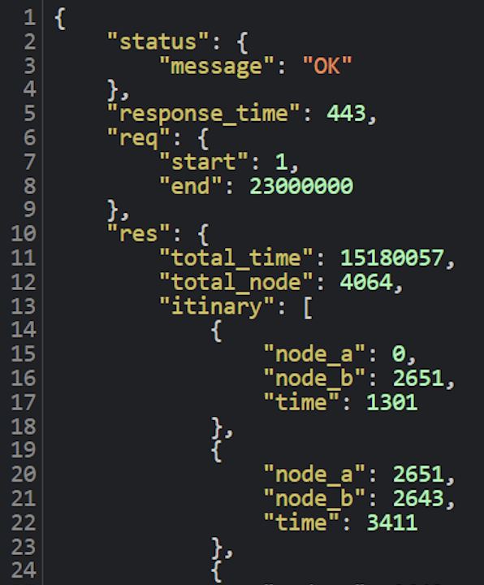

# Technical Specifications


<details>
<summary>📖 Table of content</summary>

- [Technical Specifications](#technical-specifications)
  - [I. Document](#i-document)
    - [A. Information](#a-information)
    - [B. History](#b-history)
    - [C. Overview](#c-overview)
  - [II. Solution](#ii-solution)
    - [A. Description](#a-description)
      - [1. Architectural Components](#1-architectural-components)
        - [a. Documents](#a-documents)
        - [b. API](#b-api)
        - [c. Data Management](#c-data-management)
      - [2. Workflow Example](#2-workflow-example)
      - [3. Technology Stack](#3-technology-stack)
    - [B. How it works ?](#b-how-it-works-)
      - [1. Includes](#1-includes)
      - [2. Integrity checking](#2-integrity-checking)
      - [3. Connectivity checking](#3-connectivity-checking)
      - [4. Graph](#4-graph)
      - [5. Research algorithm](#5-research-algorithm)
      - [6. API](#6-api)
    - [C. Program architecture diagram](#c-program-architecture-diagram)
  - [III. Quality Control](#iii-quality-control)
    - [A. Documentation and Reporting](#a-documentation-and-reporting)
    - [B. Development](#b-development)
  - [IV. Further considerations](#iv-further-considerations)
    - [A. Technical constraints](#a-technical-constraints)
      - [1. Writing convention](#1-writing-convention)
      - [2. C++ coding convention](#2-c-coding-convention)
    - [B. Cost estimation](#b-cost-estimation)
      - [1. Software](#1-software)
      - [2. Time \& Human](#2-time--human)
    - [C. Security](#c-security)
    - [D. Accessibility](#d-accessibility)
  - [V. Success evaluation](#v-success-evaluation)
  - [Glossary](#glossary)

</details>


## I. Document

### A. Information

| Document writer | Grégory PAGNOUX |
|---|---|
| Issue date | 01/27/2025 |
| Reviewer | Lucas MEGNAN |
| review date | 01/../2025 |

### B. History

| Version | Edits completed by | Date | Description of edit |
|---|---|---|---|
| 1.1 | Grégory PAGNOUX | 01/06/2025 | Template, [Writing convention](#1-writing-convention), [Quality Control](#iii-quality-control) part A, [Success evaluation](#v-success-evaluation) |
| 1.2 | Grégory PAGNOUX | 01/08/2025 | [Development](#b-development), [Software](#1-software), [Time & human](#2-time--human), [Overview](#c-overview), [Documents](#a-documents) |
| 1.3 | Grégory PAGNOUX | 01/14/2025 | [Coding convention](#2-c-coding-convention) |
| 1.4 | Grégory PAGNOUX | 01/16/2025 | [Description](#a-description), [Security](#c-security), [Accessibility](#d-accessibility), [Glossary](#glossary) |
| 1.5 | Grégory PAGNOUX | 01/17/2025 | [API](#b-api), [Data Management](#c-data-management), [Workflow example](#2-workflow-example), [Technology stack](#3-technology-stack), [How it works](#b-how-it-works-), [Program architecture diagram](#c-program-architecture-diagram) |

### C. Overview

SmashThePath aim to make travel easier with faster pathing using the language C++[^1] and the software Visual Studio Code (VSC)[^2]. The users can use this to gain time and travel more effectivilly and easily across the United States (the CSV[^3] file used to develop the product is the USA's map).

This project is an oppurtunity to dive into the very famous laguage C++.
Our main goal is to make a very easy and faster way to travel with an API[^4].

## II. Solution

### A. Description

To complete this project, we need to create an API that manage Nodes and Paths between them, calculate the quickest path from a point A to B, a compatibility with multiple data file type in input of the algorithm and send a response in JSON[^5] or XML[^6] format in 1 second maximum.
The algorithm nee to propose one of the 10% best path and the REST API[^7] must run on an HTTP server[^8] accessible via localhost and support concurrent requests.

#### 1. Architectural Components

##### a. Documents

```txt
📦 2024-2025-project-3-quickest-path-team-1
└── 📁 beta
|    └── 📝 a_star.cpp
|    └── 📝 api.cpp
|    └── 📝 connectivity.cpp
|    └── 📝 incl.h
|    └── 📝 integrity.cpp
|    └── 📝 loader.cpp
|    └── 📝 log.cpp
|    └── 📝 main.cpp
└── 📁 documents
|    └── 📁 images
|    └── 📁 management
|    |   └── 📁 weeklyreport
|    |   |   └── 📝 SummaryTeamAnswers.md
|    |   |   └── 📝 WeeklyReport1.md
|    |   |   └── 📝 WeeklyReport2.md
|    |   |   └── 📝 WeeklyReport3.md
|    |   |   └── 📝 WeeklyReport4.md
|    |   |   └── 📝 WeeklyReport5.md
|    |   |   └── 📝 WeeklyReport6.md
|    |   |   └── 📝 WeeklyReportTemplate.md
|    |   └── 📝 DocumentManagement.md
|    |   └── 📝 PostMortem.md
|    |   └── 📝 ProjectCharter.md
|    |   └── 📝 Settlement.md
|    └── 📝 FunctionalSpecifications.md
|    └── 📝 TechnicalSpecifications.md
|    └── 📝 TestCase.md
|    └── 📝 TestPlan.md
└── 📝 README.MD 
```

##### b. API

The API will expose endpoints for interacting with the system's core functionalities. It will include:

**Pathfinding Endpoint**:

- **Method**: `GET`
- **Input**: Source node ID, destination node ID
- **Output**:
  - Total travel time (in ms)
  - Point requseted (A, B)
  - Total time (in ms)
  - Total node
  - Itinirary [{node a, node b, time}, etc]
- **Response Formats**: JSON

**Error Handling**:

- Return structured error responses (e.g., `400 Bad Request` for invalid input, `404 Not Found` for non-existent nodes).

**Performance Goals**:

- Response times under 1 second for typical queries.

##### c. Data Management

This layer focuses on efficient data handling, ensuring scalability and compliance with privacy standards.

**Local Data Storage**:

- **Node and Path Data**: Stored locally in CSV format, such as `USA-roads.csv`.
- **Temporary Cache**: Keeps heuristics data when you launch the program, i.e. give the answer directly if you search the same point to gain time.

**Data Import**:

- Supports importing nodes and paths data directly from local CSV files.

**Security and Privacy Management**:

- **Error Detection**: Handles malformed or missing data gracefully, logging issues for debugging.
- **Data Validation**: Ensures imported data conforms to expected formats (integrity, connectivity, etc).

#### 2. Workflow Example

**Data Linking**:

- When a user uploads a data file, the system processes the data to construct the node network by making a UCG (Undirected cyclic graph)

**Algorithm Execution**:

- You need to pre-processing the algorithm to get more fast response time.
- Upon initiating the algorithm, the system calculates the quickest path between the specified nodes.

**Result Display**:



#### 3. Technology Stack

**Frontend (UI)**:

- Not required for this project; data is displayed in a text-based format listing all waypoints and distances.

**Backend (Logic & Processing)**:

- **Programming Language**: C++ for performance and memory efficiency.
- **Libraries**: Utilize C++ standard libraries for file I/O, graph algorithms A*, and JSON serialization.
- **API Framework**: Use an HTTP server library for REST API implementation.

### B. How it works ?

#### 1. Includes

To start, we need to include and implement some basic structure class for the product in the incl.h file.

```cpp
struct union_find {
    std::vector<int> parent;
    std::vector<int> rank;

    void resize(size_t n) {
        parent.resize(n);
        rank.resize(n, 0);
        for (size_t i = 0; i < n; ++i) {
            parent[i] = static_cast<int>(i);
        }
    }

    int find_set(int v) {
        if (parent[v] == v) {
            return v;
        }
        parent[v] = find_set(parent[v]);
        return parent[v];
    }

    bool union_set(int a, int b) {
        int root_a = find_set(a);
        int root_b = find_set(b);
        if (root_a == root_b) {
            return false;
        }
        if (rank[root_a] < rank[root_b]) {
            parent[root_a] = root_b;
        }
        else if (rank[root_a] > rank[root_b]) {
            parent[root_b] = root_a;
        }
        else {
            parent[root_b] = root_a;
            rank[root_a]++;
        }
        return true;
    }
};
```

*You can do that in this code.*


```cpp
struct graph_data {
    std::unordered_map<int, size_t> node_to_index;
    std::vector<std::tuple<int, int, int>> edges;

    size_t line_count = 0;
    size_t index_count = 0;

    union_find uf;

    std::unordered_map<int, std::vector<std::pair<int, int>>> adjacency;
};
```

*You can do that in this code.*


```cpp
struct path_step {
    int node_a;
    int node_b;
    int time;
};
```

*You can do that in this code.*


```cpp
struct path_result {
    int total_time;
    std::vector<path_step> steps;
};
```

*You can do that in this code.*

#### 2. Integrity checking

To check informations integrity of the data file, we are implemented an integrity_validator function in the integrity.cpp file.

<!--TODO-->

#### 3. Connectivity checking

To check the right connectivity of all nodes, we are implemented a connectivity_validator function in the connectivity.cpp file.

<!--TODO-->

#### 4. Graph

We are creating the graph in the memory in the loader.cpp file.

<!--TODO-->

#### 5. Research algorithm

The research algorithm is done thanks the A* method which is implemented in the a_star.cpp file.

<!--TODO-->

#### 6. API

Our API is implemented in the api.cpp file.

<!--TODO-->

### C. Program architecture diagram

<!--TODO-->


## III. Quality Control

The Quality Control (QC) of the project will be mainly done by the Quality Assurance (QA) of our team.

### A. Documentation and Reporting

To ensure that the whole team has the same idea of the project, the [Functional](FunctionalSpecifications.md) and [Technical](TechnicalSpecifications.md) are drawn up.

Maintain a comprehensive record of the process. This should include:
Weekly Reports: A consolidated report of the week's progress, challenges, and learnings.
Meetings: to have a debriefing of everything that has been done and needs to be done.

### B. Development

The product is control task by task and report on the [Test Case](TestCase.md) as planned on the [Test Plan](TestPlan.md).

## IV. Further considerations

### A. Technical constraints

#### 1. Writing convention

| Notation | How | Usage | Example |
| :-: | :-: | :-: | :-: |
| flatcase | we attach each word and in lowercase | naming folders | foldername |
| PascalCase | we attach each word and write the first letter of each word in uppercase | naming files | FileName |
| comment = ```<!--word-->``` | write your comment inside to have a reminder of your informations without have it visible on the document | organise and summarise informations that you need to put on each part of your document | ```<!--The following declaration creates a query. It doesn't appear on the document.-->``` |
| Titles = I.A.1.a | the first index is the most general title and the last one is to have the most detail part (preceded by #) | to have a clear idea of the organisation of the document | <pre> ```# I. Title name``` <br> ```## A. Title name``` <br> ```### 1. Title name``` <br> ```#### a. Title name``` </pre> |
| Table of content | at the beginning of the document | find a specific part of the document without going through it all |  |
| Glossary | at the end of the document | understand some word that we don't know without loose time on google |  |

You can have also [Markdown convention](https://www.markdownguide.org/basic-syntax/).

#### 2. C++ coding convention

The language used to develop the project is C++

| Notation | How | Usage | Example |
| :-: | :-: | :-: | :-: |
| comment = // | start each line with two slashes and an uppercase letter and finish the comment by a period. | give more information of the code | <pre>```// The following declaration creates a query. It doesn't run the query.```</pre> |
| comment = ```/*paragraphe*/``` | start each line with two slashes and an uppercase letter and finish the comment by a period. | give more information of the code | <pre>```/*The following declaration creates a query.``` <br> ```It doesn't run the query.*/```</pre> |
| snake_case | each words are separated by an underscore | name variable | variable_name |
| camelCase | each words are concatenate and all words start by an uppercase except the first one | name functions | functionName |
| Interface (suffix) | put the word "Interface" at the end | named interface | UserIterface |
| Abstract (prefix) | put the word "Abstract" at the beginning | named abstract base classes | AbstractUser |
| g_ (prefix) | add "g_" at the beginning separated by an underscore | named global variables | g_userCount |
| s_ (prefix) | app "s_" at the beginning separated by an underscore | named static class variables | s_instance |
| c_ (prefix) | add "c_" at the beginning separated by an underscore | named global constants | c_MAX_SIZE |
| m_ (prefix) | add "m_" at the beginning | Member variables | m_memberVar |
| T (suffix) | used as a suffix for template parameters | Template parameter names | TValue, TElement |

*source : [Gromacs](https://manual.gromacs.org/5.1-current/dev-manual/naming.html#:~:text=would%20be%20better.-,C%2B%2B%20code)*

### B. Cost estimation

#### 1. Software

The software used to develop the project, we use Visual Studio and Visual Studio Code and the data file used is a CSV (but the alghorithm needs to be compatible with other types of data documents). Those development software are used on schoool or personnal Windows and MacOS. We need an internet connection given by the ALGOSUP's wifi or personnal fiber for those who work at home.

#### 2. Time & Human

Minimum work time to accomplish the project:

| Number of people | work time/person | TOTAL |
| :-: | :-: | :-: |
| 6 | 77 h | 472 h |

### C. Security

All infromation given to the algorithm are in local, the treatement and the pre-processing is also done in local. It permit to keep the integrity of information during all the process.

### D. Accessibility

The product is developed for software people to simplify the way they make research quickly between informations linked.

## V. Success evaluation

The program is scored according to the following criteria :

- **C++ Source Code**: Including comments and clear documentation. The code has to be of your own creation, and you should not use libraries beside STL and what is required for the Web server.
- **Time and Space Complexity**: Big O notation for the main algorithms.
- **REST API Implementation**: Demonstrating the ability to handle multiple formats (XML and JSON).
- **Test Suite**: Tests to validate correctness, performance, and compliance with the 10% approximation rule.
- **Data Validation Tool**: A utility to verify the integrity of the provided CSV file.


## Glossary

[^1]: [C++](https://fr.wikipedia.org/wiki/C%2B%2B#:~:text=C%2B%2B%20est%20un%20langage,objet%20et%20la%20programmation%20générique.)
Created by Bjarne Stroustrup in 1980, C++ is one of the most widely used compiled programming languages for applications, thanks to its high performance and compatibility with the C language.
It allows programming under multiple paradigms (a way of approaching computer programming and formulating solutions to problems and their formalisation in an appropriate programming language), including procedural programming, object-oriented programming and generic programming.

[^2]: [VSC](https://code.visualstudio.com)
Visual Studio Code is a code editor created in 2015 by Microsoft that is compatible with all computers and allows you to develop any software, algorithm, application, etc. Its many applications allow you to use all possible languages and are fully customisable. The tracking and history of modifications makes it very practical and easy to use.

[^3]: [CSV](https://fr.wikipedia.org/wiki/Comma-separated_values#:~:text=Comma%2Dseparated%20values%2C%20connu%20sous,valeurs%20séparées%20par%20des%20virgules.)
Comma-Separated Value is an open text format representing tabular data in the form of comma-separated values.

[^4]: [API](https://www.cnil.fr/fr/definition/interface-de-programmation-dapplication-api#:~:text=Une%20API%20(application%20programming%20interface,des%20données%20et%20des%20fonctionnalités.))
Application Programming Interface is a software interface that enables software or a service to be ‘connected’ to another software or service in order to exchange data and functionalities.
APIs offer many possibilities, such as data portability, setting up email advertising campaigns, affiliation programmes, integrating functionalities from one site into another or open data. They can be free or paid for.

[^5]: [JSON](https://fr.wikipedia.org/wiki/JavaScript_Object_Notation)
JavaScript Object Notation was created by Douglas Crockford between 2002 and 2005.
It's a textual data format derived from the object notation of the JavaScript language. It competes with XML for the representation and transmission of structured information.

[^6]: [XML](https://fr.wikipedia.org/wiki/Extensible_Markup_Language)
Extensible Markup Language was created by World Wide Web Consortium between 1998 and 1999.
It is a generic mark-up computer metalanguage. It facilitates the automated exchange of complex content (trees, enriched text, etc.) between heterogeneous information systems.

[^7]: [REST API](https://www.ibm.com/fr-fr/topics/rest-apis)
Also called RESTful API, is an API designed in the REST (Representational State Transfer) architectural style, making it flexible and lightweight for integrating applications and connecting components in microservices architectures.

[^8]: [HTTP server](https://fr.wikipedia.org/wiki/Serveur_web)
A web server is either web resource service software (HTTP server) or a computer server (computer) that responds to requests from the World Wide Web on a public (Internet) or private (intranet)1,2,3 network, mainly using the HTTP protocol.
